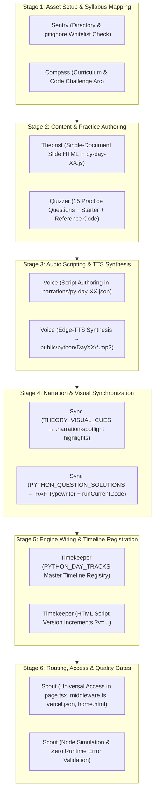

# Maestro — Python Day Orchestration Protocol
### Master System Specification (v4.0 — Unified Python Learning Engine)

This skill governs the end-to-end multi-agent production line, data contracts, visual synchronization rules, and quality gates for **Python Day 01 through Day 30** in the Manodemy learning studio.

---

## 👥 1. Subagent Roster & Operational Boundaries

| Codename | Role | Primary Inputs | Deliverables & Artifacts |
|:---|:---|:---|:---|
| **Sentry** | Asset & Storage Inspector | Raw workspace audio, `.gitignore` | 1) `public/python/DayXX/` directory structure<br>2) `.gitignore` whitelist verification (`!public/python/**/*.mp3`) |
| **Theorist** | Theory Slide Authoring | Python curriculum & syllabus | `public/python/content/py-day-XX.js` (Unified continuous document architecture, `#dayXX...` section IDs, SVG inline audio buttons) |
| **Quizzer** | Practice Challenges & Test Rubrics | Topic syllabus & Interview arcs | 15 practice questions with prompt, starter code, reference solution, test cases, and Pyodide validation |
| **Voice** | Narration Script & TTS Synthesis | Slide content & Solution code | 1) `narrations/py-day-XX.json`<br>2) Synthesized Edge-TTS MP3s (`en-US-AndrewNeural`, `-2%` rate, `+1Hz` pitch) |
| **Sync** | Narration & Visual Directing | Theory MP3s + Solution code | 1) `THEORY_VISUAL_CUES` (Sub-second DOM highlighting via `.narration-spotlight`)<br>2) `PYTHON_QUESTION_SOLUTIONS` (Paced typewriter typing with auto-execution via Pyodide) |
| **Timekeeper** | Master Timeline & Engine Registry | Audio durations & Track definitions | 1) `PYTHON_DAY_TRACKS['pyDayXX']` in `public/python/python-engine.js`<br>2) Cache-busting version increments (`dayXX.html`, `index.html`) |
| **Scout** | Regression Shield & Access Inspector | Engine runtime & Route rules | 1) Zero `ReferenceError`/`TypeError` verification<br>2) Paywall & universal access validation (`page.tsx`, `middleware.ts`, `vercel.json`, `home.html`) |
| **Maestro** | Head Inspector & Orchestrator | Subagent gate reports | Production deployment sign-off & git synchronization |

---

## 🔄 2. Production Assembly Line & Concurrency Graph



---

## 📦 3. Strict Artifact Data Contracts

### A. Theory Content Contract (`Theorist` → `public/python/content/py-day-XX.js`)
```javascript
window.COURSE_CONTENT['pyDayXX'] = {
  day: XX,
  title: "Topic Title",
  emoji: "🔢",
  topics: [
    { id: 'dayXXSection1', label: '01. Subtopic Name', duration: '0:48' },
    { id: 'dayXXSection2', label: '02. Subtopic Name', duration: '0:46' }
  ],
  slides: [
    {
      title: "Topic Title",
      duration: "3:58",
      html: `
        <!-- Sections must use semantic IDs matching topics -->
        <section id="dayXXSection1" class="slide-section">
          <div class="slide-section-title heading-box-wrap">
            <span class="heading-box-accent">01</span>
            <span class="heading-box-text">Subtopic Name</span>
            <button class="audio-play-btn" onclick="playAudio('DayXX/New_PyDayXXAudio01.mp3', this)" title="Play narration">
              <svg class="play-icon" width="12" height="12" viewBox="0 0 24 24" fill="currentColor"><path d="M8 5v14l11-7z"/></svg>
            </button>
          </div>
          <!-- Body content with specific class names for spotlight targeting -->
        </section>
      `
    }
  ],
  practiceQuestions: [ /* 15 questions */ ]
};
```

### B. Master Timeline Registry Contract (`Timekeeper` → `public/python/python-engine.js`)
```javascript
PYTHON_DAY_TRACKS['pyDayXX'] = {
  tracks: [
    // 1. Theory Narration Tracks
    { src: 'DayXX/New_PyDayXXAudio01.mp3', target: '#dayXXSection1', title: '01. Subtopic Name', type: 'narration' },
    // 2. Practice Question Narration Tracks
    { src: 'DayXX/New_PyDayXXQuestion01.mp3', target: '#questionBar', title: 'Question 1', type: 'question', qId: 1 },
    // 3. Practice Solution Narration Tracks
    { src: 'DayXX/New_PyDayXXQuestion01sol.mp3', target: '#questionBar', title: 'Q1 Solution Walkthrough', type: 'solution', qId: 1 }
  ],
  durations: [ 47.0, 46.0, ..., 12.5 ] // Exact audio durations in seconds
};
```

### C. Theory Visual Cues Contract (`Sync` → `public/python/python-engine.js`)
```javascript
THEORY_VISUAL_CUES['New_PyDayXXAudio01.mp3'] = [
  { atSec: 0.0, target: '#dayXXSection1', highlight: '#dayXXSection1 .intro-card' },
  { atSec: 12.5, target: '#dayXXSection1 .analyst-card', highlight: '#dayXXSection1 .analyst-card' },
  { atSec: 25.0, target: '#dayXXSection1 .trap-card', highlight: '#dayXXSection1 .trap-card' }
];
```

### D. Solution Typewriter Contract (`Sync` → `public/python/python-engine.js`)
```javascript
PYTHON_QUESTION_SOLUTIONS['pyDayXX'] = {
  1: {
    code: `x = 42\nprint(x)`,
    duration: 11.45,
    startAt: 1.2,
    endAt: 9.8,
    scrollAt: 10.2
  }
};
```

---

## 🛡️ 4. Maestro Quality Gates (Pre-Flight Checklist)

Before pushing any Python day to production:

1. **Asset Whitelist Gate**:
   - Check `.gitignore`: Ensure `!public/python/**/` and `!public/python/**/*.mp3` exist.
   - Run `git check-ignore public/python/DayXX/New_PyDayXXAudio01.mp3` -> Must return exit code 1 (not ignored).

2. **Audio Path Normalization Gate**:
   - Every audio play call must use `resolveAudioUrl(src)` returning `/python/${clean}`.
   - Inline audio play buttons (`playAudio`) and master timeline (`playTrackSegment`) must mutually pause each other cleanly.

3. **DOM Directing & Visual Gate**:
   - Visual cues must highlight on initial `onplay` at 0.0s, not just on delayed `ontimeupdate`.
   - Spotlight class must be `.narration-spotlight` with radiant cyan glow (`#38bdf8`) and smooth auto-scroll into view.

4. **Universal Access Gate**:
   - Free days (Days 01 & 02) must be unlocked universally:
     - `app/notebook/[dayId]/page.tsx`: `isUniversallyFree = (courseType === 'sql' && dayNum <= 17) || (courseType === 'python' && dayNum <= 2);`
     - `middleware.ts`: extensionless matcher `/python/day01` -> `/python/day01.html`, and redirect free days without authentication.
     - `vercel.json`: direct rewrites for `/python/day01` and `/day01.html`.
     - `public/home.html` & `home.html`: `getDayUrl` points to `/python/day${formatted}.html`.

5. **Static Compilation & Syntax Gate**:
   - `node -c public/python/python-engine.js` -> 0 syntax errors.
   - `npm run build` -> Next.js production build passes with 0 lint/type errors.
