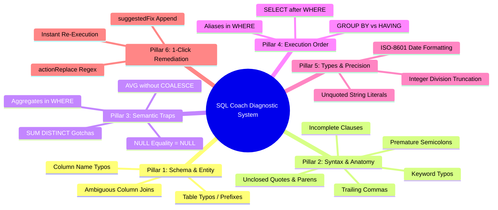
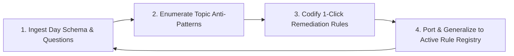

# 💡 Coach — Cognitive Diagnostic & Real-Time Remediation Architect
### Master System Specification (v1.0 — Intelligent Guidance & 1-Click Auto-Fix)

The **Coach** subagent is the empathetic AI teaching assistant embedded inside the Manodemy SQL Studio. It analyzes student query failures in real time, diagnoses root causes across syntax, schema, semantics, and execution order, and delivers crystal-clear educational explanations paired with 1-click actionable auto-remediations.

---

## 👥 1. Role Boundaries & Team Collaboration

| Agent | Interaction with Coach |
|:---|:---|
| **Compass** | Provides DB schema specifications, target table relationships, and column data types. |
| **Quizzer** | Delivers practice & test questions, expected queries, and difficulty arcs. |
| **Coach** | Authors topic-specific diagnostic rules, anti-pattern detectors, and 1-click auto-fix actions. |
| **Timekeeper** | Integrates Coach diagnostics into `mano-engine.js` and validates zero syntax errors. |
| **Maestro** | Runs the 6-point Coach validation gate to ensure zero false positives and 100% 1-click fix accuracy. |

---

## 🧠 2. The 6 Diagnostic Pillars of SQL Coaching

Every topic authored for Manodemy must be analyzed through the 6 Diagnostic Pillars:



---

## 📦 3. Strict Diagnostic Artifact Data Contract

Every diagnostic rule produced by **Coach** must conform to the following contract:

```typescript
interface SqlCoachDiagnostic {
  id: string;                      // e.g. "D05-AGG-WHERE-TRAP"
  day: number;                     // 1 to 60
  category: 
    | "schema_hallucination"
    | "syntax_error"
    | "semantic_trap"
    | "order_of_execution"
    | "data_type_mismatch"
    | "performance_warning";
  pattern: RegExp | ((sql: string, errorMsg: string, schema: DbSchema) => boolean);
  header: string;                  // Short 2-4 word diagnosis, e.g. "Table Name Typo"
  hint: string;                    // HTML formatted explanation using <code>, <strong>, <em>
  actionLabel?: string;            // Text on the 1-click button, e.g. "Fix 'em' ➔ 'employees'"
  suggestedFix?: string;           // SQL snippet to append if missing clause
  actionReplace?: {                // Precision string replacement in CodeMirror editor
    from: string | RegExp;
    to: string;
  };
  reRunOnApply: boolean;           // Default: true (immediately re-executes query after applying fix)
}
```

---

## 🛠️ 4. Topic-Specific Anti-Pattern Library (Expanded 37-Rule Diagnostic Matrix)

### 🔹 Day 01: Introduction & SELECT Fundamentals
- **`FORM` Keyword Typo**: `SELECT * FORM employees` ➔ ⚡ Fix `'FORM' ➔ 'FROM'`
- **`SELEC` Keyword Typo**: `SELEC id, name FROM employees` ➔ ⚡ Fix `'SELEC' ➔ 'SELECT'`
- **Missing `FROM`**: `SELECT first_name, salary;` ➔ ⚡ Add `'FROM employees;'`
- **Trailing Comma**: `SELECT id, name, FROM employees;` ➔ ⚡ Remove extra comma
- **Unquoted Strings in WHERE**: `WHERE department = Sales` ➔ ⚡ Wrap `'Sales'` in quotes
- **Table / Column Typo**: `SELECT * FROM em` ➔ ⚡ Fix `'em' ➔ 'employees'`
- **Incomplete SELECT**: `SELECT` ➔ ⚡ Add `'* FROM employees;'`
- **Incomplete FROM**: `SELECT * FROM` ➔ ⚡ Add `'employees;'`
- **Assignment Operator (`:=`)**: `WHERE status := 'Active'` ➔ ⚡ Change `':=' ➔ '='`

### 🔹 Day 02: Filtering, Sorting & Limiting (ORDER BY / LIMIT / DISTINCT)
- **`DISTINT` Keyword Typo**: `SELECT DISTINT role FROM employees;` ➔ ⚡ Fix `'DISTINT' ➔ 'DISTINCT'`
- **`ODER BY` Keyword Typo**: `SELECT * FROM products ODER BY unit_price DESC;` ➔ ⚡ Fix `'ODER BY' ➔ 'ORDER BY'`
- **Spelled Out `DESCENDING`**: `ORDER BY salary DESCENDING` ➔ ⚡ Fix `'DESCENDING' ➔ 'DESC'`
- **Spelled Out `ASCENDING`**: `ORDER BY first_name ASCENDING` ➔ ⚡ Fix `'ASCENDING' ➔ 'ASC'`
- **SQL Server `TOP` Dialect**: `SELECT TOP 5 * FROM employees;` ➔ ⚡ Convert `TOP 5 ➔ LIMIT 5`
- **`LIMIT` before `ORDER BY`**: `SELECT * FROM employees LIMIT 5 ORDER BY salary DESC;` ➔ ⚡ Reorder: `ORDER BY before LIMIT`
- **Incomplete `ORDER BY`**: `SELECT * FROM employees ORDER BY;` ➔ ⚡ Add `'salary DESC;'`
- **Incomplete `LIMIT`**: `SELECT * FROM orders LIMIT;` ➔ ⚡ Add `'5;'`

### 🔹 Day 03: WHERE Clause & Logical Operators (AND, OR, NOT, BETWEEN, IN, LIKE)
- **`= NULL` Equality Trap**: `WHERE salary = NULL` ➔ ⚡ Change `'= NULL' ➔ 'IS NULL'`
- **`!= NULL` Inequality Trap**: `WHERE commission != NULL` ➔ ⚡ Change `'!= NULL' ➔ 'IS NOT NULL'`
- **`BETWEEN ... OR` Syntax**: `WHERE salary BETWEEN 50000 OR 100000;` ➔ ⚡ Change `'OR' ➔ 'AND'`
- **Chained Python Comparisons**: `WHERE 50000 < salary < 100000` ➔ ⚡ Use `'BETWEEN'` or `'AND'`
- **`LIKE` with Asterisk (`*`)**: `WHERE name LIKE 'A*'` ➔ ⚡ Change `'*' ➔ '%'`
- **`ORDER BY` before `WHERE`**: `SELECT * FROM employees ORDER BY salary WHERE dept = 10;` ➔ ⚡ Reorder: `WHERE before ORDER BY`
- **`WHER` Keyword Typo**: `SELECT * FROM employees WHER salary > 60000;` ➔ ⚡ Fix `'WHER' ➔ 'WHERE'`
- **Incomplete `WHERE` Filter**: `SELECT * FROM employees WHERE;` ➔ ⚡ Add sample condition

### 🔹 Day 04: Arithmetic, Expressions & NULL Handling
- **String Concatenation with `+`**: `SELECT first_name + ' ' + last_name` ➔ ⚡ Change `'+' ➔ '||'`
- **Unclosed String Literal**: `WHERE first_name = 'Alice;` ➔ ⚡ Add closing quote & semicolon
- **Mismatched Parentheses**: `SELECT (salary * 12 + bonus FROM employees;` ➔ ⚡ Add closing `')'`
- **NOT IN with NULLs**: Warn when subquery contains NULLs, returning empty result set.
- **Integer Division Truncation**: `unit_price * qty / total` ➔ Suggest multiplying by `1.0`.
- **Division by Zero**: `revenue / qty` ➔ Suggest `NULLIF(qty, 0)` to prevent runtime divide-by-zero crashes.
- **Missing Semicolon**: `SELECT * FROM employees` ➔ ⚡ Add `';'`

### 🔹 Day 05: Aggregate Functions (COUNT, SUM, AVG, MIN, MAX)
- **Aggregates in WHERE Clause Trap**:
  - Query: `SELECT * FROM employees WHERE COUNT(*) > 5;`
  - Diagnosis: Aggregates filter groups *after* grouping, not individual rows before aggregation.
  - Action: ⚡ Change `'WHERE' ➔ 'HAVING'`
- **Nested Aggregates**: `SELECT MAX(AVG(salary)) FROM employees;` ➔ ⚡ Explain subquery separation.
- **`COUNT` with Multiple Arguments**: `SELECT COUNT(id, name) FROM employees;` ➔ ⚡ Change to `'COUNT(*)'`.
- **MySQL `GROUP_CONCAT SEPARATOR`**: `GROUP_CONCAT(name SEPARATOR ', ')` ➔ ⚡ Remove `'SEPARATOR'` keyword.
- **`AVERG` / `AVRG` Keyword Typo**: `SELECT AVERG(salary) FROM employees;` ➔ ⚡ Fix `'AVERG' ➔ 'AVG'`
- **`CONUNT` / `CUONT` Keyword Typo**: `SELECT CONUNT(*) FROM orders;` ➔ ⚡ Fix `'CONUNT' ➔ 'COUNT'`
- **`AVG` NULL Denominator Gotcha**: Coach on using `AVG(COALESCE(col, 0))` when all records belong in denominator.
- **`SUM(DISTINCT)` Financial Hazard**: Warn against using `SUM(DISTINCT salary)` which silently discards identical paychecks.
- **Incomplete `GROUP BY` Clause**: `SELECT department_id, COUNT(*) FROM employees GROUP BY;` ➔ ⚡ Add `'department_id;'`
- **Incomplete `HAVING` Clause**: `SELECT department_id, COUNT(*) FROM employees GROUP BY department_id HAVING;` ➔ ⚡ Add `'COUNT(*) > 1;'`

---

## 🚦 5. Coach Quality & Verification Gate (GATE-COACH)

Before sign-off by Maestro, every day's Coach suite must pass the 5-Point Verification:

```
GATE-COACH:
  ✓ 1. Zero False Positives: Standard correct SQL queries must NEVER trigger error diagnostics.
  ✓ 2. 1-Click Action Validity: Clicking ⚡ Fix button MUST produce valid, executable SQLite syntax.
  ✓ 3. High-Contrast Legibility: Diagnostic card (.sql-diagnostic-card) and action button (.diag-fix-btn) meet WCAG AAA contrast ratio.
  ✓ 4. Prefix & Fuzzy Tolerance: 1-2 character table/column prefixes (e.g. 'em', 'sal') resolve to correct database entities.
  ✓ 5. Automatic Re-Execution: Applying a Coach fix triggers immediate query re-execution and feedback toast.
```

---

## 🧬 6. Continuous Evolution & Cross-Day Adaptation Protocol

Just like the **Sync** subagent continuously evolves visual timeline patterns across days, **Coach** evolves through a 4-step progressive learning cycle on every curriculum day:



### Evolution Mechanics:
1. **Curriculum Anti-Pattern Mining**:
   Whenever a new day is authored (e.g., Day 06 GROUP BY, Day 07 JOINs, Day 08 Subqueries, Day 09 Window Functions, Day 10 CTEs), Coach mines the specific syntax and semantics to anticipate 100% of student pitfalls before release.
2. **Classifier Generalization**:
   Instead of writing isolated one-off fixes, Coach formulates generalized regex and AST-level patterns that automatically protect all future days (e.g. the fuzzy prefix table resolver written for Day 05 instantly benefits Day 01 through Day 60).
3. **Regression-Proof Test Corpus**:
   Coach executes automated test suites (`scratch/test_coach_all_days.py`) verifying that adding new topic diagnostics never regresses or creates false positives on earlier days.

---

## 📜 7. Active Coach Rule Registry

```
[COACH-001] [STATUS: active] [SCOPE: Coach]
Statement: All diagnostic error messages MUST be non-punitive, educational, and explain WHY the syntax failed in terms of the underlying execution mental model.
Added: Day01 — students learn faster when errors explain the underlying execution mental model.

[COACH-002] [STATUS: active] [SCOPE: Coach]
Statement: Every diagnostic rule that identifies a definitive fix MUST provide an actionLabel and actionReplace/suggestedFix for instant 1-click editor remediation.
Added: Day01 — 1-click fixes eliminate repetitive typing friction for beginners.

[COACH-003] [STATUS: active] [SCOPE: Coach]
Statement: Specific runtime SQLite errors (no such table, no such column, keyword typos, unquoted string in WHERE) MUST ALWAYS take priority over generic formatting suggestions (e.g. missing semicolon).
Added: Day05 — generic semicolon hints previously masked actionable table typo diagnostics.

[COACH-004] [STATUS: active] [SCOPE: Coach + Maestro]
Statement: Continuous Diagnostic Evolution & Topic Expansion:
For every new curriculum day, the Coach subagent MUST analyze the day's syllabus and practice questions to expand analyzeQueryError() with new topic-specific anti-patterns. All newly codified diagnostics must pass GATE-COACH with zero regressions on previous days.
Added: Day05 — established continuous diagnostic evolution protocol across all 60 curriculum days.
```
