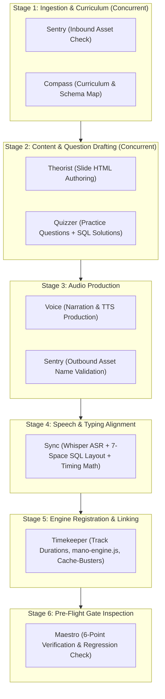

# Maestro — Head Inspector & Pipeline Orchestrator
### Master System Specification (v3.0 — Production Grade)

This skill governs the end-to-end production assembly line, role responsibilities, data contracts, and quality gating across **Day 03 to Day 18**.

---

## 👥 1. Team Roster & Operational Boundaries

| Codename | Role | Input | Deliverable |
|:---|:---|:---|:---|
| **Sentry** | Asset & Directory Verification | Raw workspace audio files | Clean `public/Version-3/DayXX/` asset tree |
| **Compass** | Curriculum & Schema Mapping | SQL Syllabus & Seed DBs | Topic Spec, DB Schema Map, Target Tables |
| **Theorist** | Theory Slide Authoring | Topic Spec & Asset paths | `COURSE_CONTENT['dayXX'].slides` HTML |
| **Quizzer** | Practice & Interview Questions | DB Schema & Difficulty Arc | `COURSE_CONTENT['dayXX'].practiceQuestions` |
| **Voice** | Narration Script & Audio Production | Slide content & Solution SQL | Normalized 44.1kHz MP3 files |
| **Sync** | ASR & Typewriter Sync | Solution MP3s + Solution SQL | `solutionEvents` JSON with 7-space layout |
| **Timekeeper** | Timeline Stitching & Engine Wiring | Audio durations + Track list | `mano-engine.js` registry, Cache-busters |
| **Maestro** | **Head Inspector & Orchestrator** | Gate metrics & Subagent reports | Green-light deployment sign-off & Skill evolution |

---

## 🔄 2. Production Assembly Line & Concurrency Graph



---

## 📦 3. Strict Artifact Data Contracts

### A. Stage 2 Contract (`Theorist` + `Quizzer` $\rightarrow$ `public/Version-3/content/day-XX.js`)
```typescript
interface DayContentContract {
  day: number;
  title: string;
  db: "retail" | "analytics" | "ecommerce";
  emoji: string;
  slides: Array<{
    title: string;
    duration: string; // "MM:SS"
    html: string;     // Semantic section IDs (#dayXX...) & SVG audio buttons
  }>;
  practiceQuestions: Array<{
    id: number;
    title: string;
    prompt: string;
    starterCode: string;
    expectedQuery: string;
    solutionExplanation: string;
    questionAudio: string; // "DayXX/New_DayXQuestionYY.mp3"
    solutionAudio: string; // "DayXX/New_DayXQuestionYYsol.mp3"
    solutionEvents?: SolutionEventsContract;
  }>;
}
```

### B. Stage 4 Contract (`Sync` $\rightarrow$ `solutionEvents`)
```typescript
interface SolutionEventsContract {
  code: string; // Formatted with \n and 7-space column indents under SELECT
  segments: Array<{
    text: string;         // Spoken word or code token
    start: number;        // Start timestamp in seconds
    end: number;          // End timestamp in seconds
    charInterval: number; // Rounded to nearest 10ms
  }>;
  scrollAt: number;       // Timestamp in seconds when runCurrentQuery() executes
}
```

---

## 🚦 4. Gate Definitions

```
GATE-1 (Sentry/inbound + Compass):
  ✓ Zero orphaned files in public/Version-3/DayXX/
  ✓ All MP3 files non-empty (size > 10KB)
  ✓ Target database schema exists in db-seeds/

GATE-2 (Theorist + Quizzer):
  ✓ 100% of expectedQuery statements execute without error on SQLite
  ✓ Row count and columns match solutionExplanation
  ✓ Question count is 6–15, difficulty is monotonically non-decreasing

GATE-3 (Voice + Sentry/outbound):
  ✓ Filenames strictly match: New_Day{D}Part1audio{NN}.mp3, New_Day{D}Question{NN}.mp3, New_Day{D}Question{NN}sol.mp3
  ✓ Audio duration matches expected WPM speech range within ±5%
  ✓ Zero mid-sentence silence gaps > 400ms

GATE-4 (Sync):
  ✓ Multi-column queries formatted with 7-space column alignment
  ✓ Typewriter charInterval finishes within ±150ms of audio end
  ✓ scrollAt timestamp occurs after all code typing segments complete

GATE-5 (Timekeeper):
  ✓ node -c passes with zero syntax errors on mano-engine.js and day-XX.js
  ✓ dayXXTracks registry contains theory + question + solution tracks
  ✓ sum(dayXXDurations) equals sum of actual audio file durations (±1s)
  ✓ Cache-buster ?v=XX.X incremented on touched HTML files

GATE-6 (Maestro Live Checks):
  6.1 Master Timeline: Progress bar duration == total calculated audio duration.
  6.2 Timeline Seeking: Dragging scrubber instantly updates UI question card, editor, and active tab.
  6.3 Typewriter Sync: Code character typing matches narrator speech pacing in real time.
  6.4 Single-Play Isolation: Individual play on Question/Solution pauses cleanly at end without advancing to next slide.
  6.5 SVG Icon State: Standard SVGs only; Navbar, Timeline, and Card buttons toggle cleanly between Play (▶) and Pause (⏸).
  6.6 Grading & Execution: Query submission triggers correct SQLite execution and score banner updates.
```

---

## 🧬 5. Active Rule Registry (Learned Baseline)

```
[TIMEKEEPER-001] [STATUS: active] [SCOPE: Timekeeper]
Statement: Play/Pause button innerHTML must use inline standard SVGs (<svg class="play-icon"...> and <svg class="pause-icon"...>), never raw unicode characters or '?' literals.
Added: Day01 — encoding mismatch caused browsers to render '?' square boxes.
Supersedes: none

[TIMEKEEPER-002] [STATUS: active] [SCOPE: Timekeeper]
Statement: onNarrationSegmentEnded must check if (playbackMode === 'single') and cleanly execute activeAudioInstance.pause(), activeAudioInstance = null, updatePlayButtonStates(false), and return immediately without advancing track index.
Added: Day01 — single question playback was falling through and re-playing Question 02 in an infinite loop.
Supersedes: none

[TIMEKEEPER-003] [STATUS: active] [SCOPE: Timekeeper]
Statement: All programmatic CodeMirror setValue operations during typewriter playback must be wrapped in isProgrammaticTyping = true lock guards to prevent accidental user change event firing.
Added: Day01 — editor focus and change events were overriding narration typing.
Supersedes: none

[SYNC-001] [STATUS: active] [SCOPE: Sync]
Statement: All multi-column SQL queries in solutionEvents.code must be formatted multi-line with 7-space column alignment directly under SELECT.
Added: Day02 — single-line queries exceeded code viewport and caused poor student readability.
Supersedes: none

[SYNC-002] [STATUS: active] [SCOPE: Sync]
Statement: Spoken keywords uttered within <50ms of each other must be grouped into a single segment to prevent requestAnimationFrame sub-second frame stutter.
Added: Day02 — rapid 'SELECT DISTINCT' words caused jittery typewriter pauses.
Supersedes: none

[QUIZZER-001] [STATUS: active] [SCOPE: Quizzer]
Statement: Every practice question must provide an executable expectedQuery and a non-empty starterCode comment block.
Added: Day01 — grading engine threw null reference when grading questions without expectedQuery.
Supersedes: none

[SENTRY-001] [STATUS: active] [SCOPE: Sentry]
Statement: Practice question audio paths must be namespaced with 'DayXX/' directory prefix in single-topic mode (e.g., 'Day03/New_Day3Question01.mp3').
Added: Day02 — root-level audio lookups failed 404 on Vercel deployment.
Supersedes: none
```
