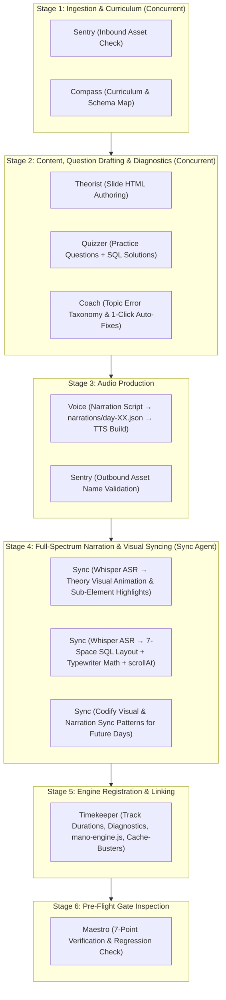

# Maestro — Head Inspector & Pipeline Orchestrator
### Master System Specification (v3.2 — Full-Spectrum Sync & Continuous Evolution)

This skill governs the end-to-end production assembly line, role responsibilities, data contracts, and quality gating across **Day 03 to Day 18**.

---

## 👥 1. Team Roster & Operational Boundaries

| Codename | Role | Input | Deliverable |
|:---|:---|:---|:---|
| **Sentry** | Asset & Directory Verification | Raw workspace audio files | Clean `public/Version-3/DayXX/` asset tree |
| **Compass** | Curriculum & Schema Mapping | SQL Syllabus & Seed DBs | Topic Spec, DB Schema Map, Target Tables |
| **Theorist** | Theory Slide Authoring | Topic Spec & Asset paths | `COURSE_CONTENT['dayXX'].slides` HTML |
| **Quizzer** | Practice & Interview Questions | DB Schema & Difficulty Arc | `COURSE_CONTENT['dayXX'].practiceQuestions` |
| **Coach** *(New & Evolving)* | **Cognitive Diagnostics & 1-Click Auto-Fix Engine** | Topic Spec + Practice Questions + DB Schema | 1) Topic-specific anti-pattern diagnostic rules<br>2) 1-click actionable auto-fixes (`applyCoachFix`)<br>3) Interactive Schema Peeking Tooltips<br>4) Codified error classifiers for continuous curriculum evolution |
| **Voice** | Narration Script & Audio Production | Slide content & Solution SQL | Normalized MP3 files in `public/Version-3/DayXX/` |
| **Sync** *(Upgraded)* | **Full-Spectrum Narration & Visual Syncing + Pattern Evolution** | Theory & Solution MP3s + Slide HTML + Solution SQL | 1) Whisper ASR sub-second Theory Visual Sync handlers (`updateTableHighlights`, card spotlights, timeline progressions)<br>2) `solutionEvents` JSON with 7-space layout<br>3) Codified sync patterns for future day evolution |
| **Timekeeper** | Timeline Stitching & Engine Wiring | Audio durations + Track list | `mano-engine.js` registry, Cache-busters |
| **Maestro** | **Head Inspector & Orchestrator** | Gate metrics & Subagent reports | Green-light deployment sign-off & Skill evolution |

---

## 🔄 2. Production Assembly Line & Concurrency Graph



---

## 📦 3. Strict Artifact Data Contracts

### A. Stage 2 Contract (`Theorist` + `Quizzer` → `public/Version-3/content/day-XX.js`)
```typescript
interface DayContentContract {
  day: number;
  title: string;
  db: "retail" | "analytics" | "ecommerce";
  emoji: string;
  slides: Array<{
    title: string;
    duration: string; // "MM:SS"
    html: string;     // Semantic section IDs (#dayXX...) & SVG audio buttons
  }>;
  practiceQuestions: Array<{
    id: number;
    title: string;
    prompt: string;
    starterCode: string;
    expectedQuery: string;
    solutionExplanation: string;
    questionAudio: string; // "DayXX/New_DayXQuestionYY.mp3"
    solutionAudio: string; // "DayXX/New_DayXQuestionYYsol.mp3"
    solutionEvents?: SolutionEventsContract;
  }>;
}
```

### B. Stage 3 Contract (`Voice` → `narrations/day-XX.json`)
```typescript
interface NarrationScriptContract {
  day: number;
  title: string;
  lecture: Record<string, string>;   // "New_DayXPart1audioNN.mp3" → narration text
  questions: Record<string, string>; // "New_DayXQuestionNN.mp3" & "...sol.mp3" → narration text
}
```

**Voice writing rules (enforced):**
- Lecture scripts: 1–3 sentences per audio file. Spoken at natural pace (~130 WPM). Matches exactly what the slide displays.
- Question scripts: State the task clearly and directly.
- Solution scripts: Read out the query verbatim in spoken form (not code). Say column names as words. Say SQL keywords aloud.
- Never include code formatting in narration text — write as spoken words only.

### C. Stage 4 Contracts (`Sync` → Full-Spectrum Visual & Audio Alignment)

#### 1. Theory Visual Sync Handlers (`Sync` → `mano-engine.js`)
```typescript
interface TheoryVisualSyncContract {
  trackSrc: string;        // "DayXX/New_DayXPart1audioNN.mp3"
  visualContainer: string; // DOM ID (e.g., "#day03OpsTable", "#day03PrecWrap")
  elements: Array<{
    selector: string;      // "tbody tr:nth-child(1)", ".prec-card--not", etc.
    activeClass: string;   // "narration-highlight", "row-active-spotlight", etc.
    start: number;         // Whisper ASR word start timestamp (seconds)
    end: number;           // Whisper ASR word end timestamp (seconds)
  }>;
}
```

#### 2. Solution Typewriter Sync (`Sync` → `solutionEvents`)
```typescript
interface SolutionEventsContract {
  code: string; // Formatted with \n and 7-space column indents under SELECT
  segments: Array<{
    text: string;         // Spoken word or code token
    start: number;        // Start timestamp in seconds
    end: number;          // End timestamp in seconds
    charInterval: number; // Rounded to nearest 10ms
  }>;
  scrollAt: number;       // Timestamp in seconds when runCurrentQuery() executes
}
```

---

## 🚦 4. Gate Definitions

```
GATE-1 (Sentry/inbound + Compass):
  ✓ Zero orphaned files in public/Version-3/DayXX/
  ✓ All MP3 files non-empty (size > 10KB)
  ✓ Target database schema exists in db-seeds/

GATE-2 (Theorist + Quizzer):
  ✓ 100% of expectedQuery statements execute without error on SQLite
  ✓ Row count and columns match solutionExplanation
  ✓ Question count is 6–15, difficulty is monotonically non-decreasing

GATE-3 (Voice + Sentry/outbound):
  ✓ narrations/day-XX.json exists with lecture + questions sections
  ✓ Filenames strictly match: New_Day{D}Part1audio{NN}.mp3, New_Day{D}Question{NN}.mp3, New_Day{D}Question{NN}sol.mp3
  ✓ All MP3 file sizes > 10KB (non-empty, valid TTS output)
  ✓ Zero duplicate question audio references in day-XX.js HTML
  ✓ Every practiceQuestion[].questionAudio and .solutionAudio has a corresponding file on disk
  ✓ Audio play buttons wired in both the theory slide HTML AND practiceQuestions[] objects

GATE-4 (Sync — Full-Spectrum Sync Inspection):
  ✓ Visual Scoping & Isolation: Every theory narration track mounts ONLY its intended visual presentation card/section.
  ✓ Viewport Positioning: Active cards/elements are centered with clean vertical visibility without clipping or awkward overflow.
  ✓ Dual-Mode Parity: Visual isolation and animations behave identically whether triggered via Master Timeline "Play Lesson", Individual ▶ buttons, or Scrubbing/Seeking.
  ✓ Sub-Element Highlights: 100% of narrated rows, comparison cards, Venn diagrams, and timeline steps have verified Whisper ASR millisecond timestamps.
  ✓ Zero stale hardcoded animation intervals in mano-engine.js.
  ✓ Multi-column queries formatted with 7-space column alignment directly under SELECT.
  ✓ Typewriter charInterval finishes within ±150ms of audio end.
  ✓ scrollAt timestamp occurs after all code typing segments complete.
  ✓ Newly developed theory sync patterns are codified into the Active Rule Registry for future day reuse.

GATE-COACH (Coach — Cognitive Diagnostic & Remediation Gate):
  ✓ Topic Error Coverage: 100% of day-specific cognitive pitfalls, syntax errors, and semantic traps are classified in analyzeQueryError().
  ✓ Actionable 1-Click Fixes: Every detected typo or missing clause provides a valid, executable ⚡ Fix button (.diag-fix-btn).
  ✓ Schema & Prefix Tolerance: 1-2 character table/column prefixes (e.g. 'em' ➔ 'employees', 'sal' ➔ 'salary') resolve accurately to valid database entities.
  ✓ Schema Peeking Suite: All <code> tags referencing tables and columns have interactive hover/click tooltips (initSchemaCodePeeking) with 1-click column insertion.
  ✓ Continuous Evolution: Newly discovered student error patterns are codified into the Active Coach Registry for future days.

GATE-5 (Timekeeper):
  ✓ node -c passes with zero syntax errors on mano-engine.js and day-XX.js
  ✓ dayXXTracks registry contains theory + question + solution tracks
  ✓ sum(dayXXDurations) equals sum of actual audio file durations (±1s)
  ✓ Cache-buster ?v=XX.X incremented on touched HTML files

GATE-6 (Maestro Live Checks):
  6.1 Master Timeline: Progress bar duration == total calculated audio duration.
  6.2 Timeline Seeking: Dragging scrubber instantly updates UI question card, editor, and active tab with zero latency.
  6.3 Visual Scoping & Positioning: Active card is isolated, correctly centered, and non-active cards are hidden.
  6.4 Theory Sync: Visual rows, cards, and diagrams light up in exact synchrony with the narrator's voice.
  6.5 Typewriter Sync: Code character typing matches narrator speech pacing in real time.
  6.6 Single-Play Isolation: Individual play on Question/Solution pauses cleanly at end without advancing to next slide.
  6.7 SVG Icon State: Standard SVGs only; Navbar, Timeline, and Card buttons toggle cleanly between Play (▶) and Pause (⏸).
  6.8 Grading & Execution: Query submission triggers correct SQLite execution and score banner updates.
  6.9 SQL Coach Execution: Triggering deliberate syntax errors renders interactive auto-fix buttons and executes cleanly on click.
```

---

## 🧬 5. Active Rule Registry (Learned Baseline)

```
[SYNC-001] [STATUS: active] [SCOPE: Sync]
Statement: All multi-column SQL queries in solutionEvents.code must be formatted multi-line with 7-space column alignment directly under SELECT.
Added: Day02 — single-line queries exceeded code viewport and caused poor student readability.
Supersedes: none

[SYNC-002] [STATUS: active] [SCOPE: Sync]
Statement: Spoken keywords uttered within <50ms of each other must be grouped into a single segment to prevent requestAnimationFrame sub-second frame stutter.
Added: Day02 — rapid 'SELECT DISTINCT' words caused jittery typewriter pauses.
Supersedes: none

[SYNC-003] [STATUS: active] [SCOPE: Sync]
Statement: Theory Visual Synchronization Protocol: Every animated visual element (table row, card, Venn diagram, lifecycle node) referenced in theory narration MUST have sub-second Whisper ASR timestamps extracted and wired in mano-engine.js timeupdate dispatch.
Added: Day03 — hardcoded legacy timestamps caused table rows to desync completely from narration.
Supersedes: none

[SYNC-004] [STATUS: active] [SCOPE: Sync]
Statement: Theory Sync Evolution & Pattern Porting: Any newly established theory visual sync pattern (e.g., table row multi-segment highlight, multi-card precedence highlight, execution order timeline step progression) must be abstracted and documented as a reusable pattern for all future days.
Added: Day03 — user mandated that Sync agent take complete ownership of theory visual syncing and evolve patterns for subsequent days.
Supersedes: none

[SYNC-005] [STATUS: active] [SCOPE: Sync]
Statement: Zero Stale Hardcoded Timestamps: Whenever narration audio is regenerated or revised via Voice TTS, Sync MUST immediately rerun Whisper ASR to recalibrate visual animation timings against actual audio length.
Added: Day03 — changing audio file duration broke hardcoded row highlight intervals.
Supersedes: none

[SYNC-006] [STATUS: active] [SCOPE: Sync]
Statement: Dual-Mode Visual Scoping, Positioning & Viewport Parity: The Sync Agent must ensure that whenever a narration track plays (whether sequentially through the master timeline, individually via section play button, or when seeking/scrubbing), the exact visual element / section being explained is isolated, positioned cleanly, and auto-scrolled to center viewport. Non-active sections must be hidden (.section-hidden), and on pause/stop, full visibility must be cleanly restored.
Added: Day03 — user mandated that Sync agent ensure proper visual framing and viewport positioning across both timeline and individual playback modes.
Supersedes: none

[SYNC-007] [STATUS: active] [SCOPE: Sync]
Statement: Progressive Code Block Narration Alignment: Whenever multiple SQL queries or syntax examples are explained in a single narration track, code presentation MUST use .code-block-container and .code-subblock elements with distinct IDs. The Sync Agent must extract Whisper ASR timestamps to progressively illuminate the active query with glowing active-spotlight styles (.code-active-spotlight, .narration-highlight) matching speech pacing.
Added: Day03 — monolithic code blocks left students uncertain which query was being explained; progressive illumination provides clear UX across timeline and individual play.
Supersedes: none

[SYNC-008] [STATUS: active] [SCOPE: Sync]
Statement: Anti-Cropping Top-Alignment Protocol: During narration playback or isolated card presentation, container scroll MUST strictly reset to top: 0 (or scroll relative to the parent .slide-section rather than internal child elements). Scrolling to child elements clips the card heading, audio buttons, and top border behind the sticky header bar.
Added: Day03 — scrolling to inner <pre> elements caused comparison examples heading to be cropped under #slideHeader.
Supersedes: none

[SYNC-009] [STATUS: active] [SCOPE: Sync]
Statement: High-Contrast Code Illumination: Active code highlights (.code-active-spotlight, .narration-highlight) must maintain deep dark IDE background (linear-gradient #091329 to #0d1b3a) with a crisp neon left border beacon (4.5px solid #38bdf8) and luminous syntax tokens (#ffffff text, #38bdf8 keywords, #7dd3fc comments). Never apply milky, semi-transparent light blue fills that wash out keyword contrast.
Added: Day03 — washed out light blue fill made code keywords low-contrast during Audio 02 narration.
Supersedes: none

[SYNC-010] [STATUS: active] [SCOPE: Sync]
Statement: Discrete Section Granularity for Multi-Track Concepts: When a theoretical topic has multiple sub-narration tracks (e.g. Venn diagrams vs. Operator Precedence rule notes), each sub-track must reside in its own dedicated .slide-section container so that neither card exceeds standard viewport height (max 400px) or causes top/bottom clipping during narration.
Added: Day03 — compound section containing both Venn diagrams and Precedence note caused Venn diagrams to be clipped when Precedence note played.
Supersedes: none

[SYNC-011] [STATUS: active] [SCOPE: Sync]
Statement: Immediate Pause-State Full-Document Scrollability: Whenever narration playback pauses or finishes (via timeline pause, single track inline button pause, or segment completion), the engine MUST execute clearSlidePlaybackVisibility() to unhide all .slide-section elements across all container DOM elements. The student must be free to read and scroll the complete lesson document whenever audio is not actively playing.
Added: Day03 — pausing narration previously left other sections hidden (.section-hidden), preventing users from freely scrolling through the full theory document.
Supersedes: none

[SYNC-012] [STATUS: active] [SCOPE: Sync]
Statement: Real-Time Zero-Latency Audio Triggering: Audio playback initiation must start synchronously within the user gesture event handler, avoiding destructive audio instance reset (activeAudioInstance.src = "") or blocking manifest fetches, so audio starts instantly without lag when Play is clicked.
Added: Day03 — destructive audio unloading caused a delay between click and playback.
Supersedes: none

[SYNC-013] [STATUS: active] [SCOPE: Sync]
Statement: Complete Irrelevant Content Hiding (display: none) & Day-Specific Entrance Protocol: During narration playback of ANY track, all non-active slide sections MUST be strictly and completely hidden (display: none !important via .section-hidden) — never blurred, dimmed, or partially visible. The student must see ONLY the active concept card in pristine isolation. On Track 01 (opener): Day 01 uses hero zoom-pop entrance (.stunning-section-entry), while Day 03 uses smooth slide-from-down entrance (.day03-slide-entry). From Track 02 onwards, the active section mounts cleanly without zoom-pop (.instant-display) at top: 0 (scrollParent.scrollTop = 0). On pause/stop, clearSlidePlaybackVisibility() instantly restores full visibility (display: '') of all sections across the entire slide document for full scrollability. Play/pause event handlers MUST call updatePlayButtonStates(isPlaying) without ReferenceErrors and support seamless unpause/resume.
Added: Day03 — user strictly mandated that irrelevant content must be 100% hidden (display: none !important) without blur, Day 03 uses smooth slide from down on start, and play/pause operates without errors.
Supersedes: none

[SYNC-014] [STATUS: active] [SCOPE: Sync]
Statement: Zero-Shift UI & Play Button Dimensional Lock: All play/pause buttons (.audio-play-btn) and their parent header flex containers MUST have strict dimensional locks (width/height: 24px, margin: 0, padding: 0, flex-shrink: 0) across both idle (▶) and active (⏸) states. All card header rows MUST use display: flex; align-items: center; justify-content: space-between; gap: 8px; width: 100%; with flex: 1 on title labels, guaranteeing zero layout shift or alignment jumping between idle and narration playback states.
Added: Day03 — inconsistent header justify-content and button margins caused visual alignment jumps between idle and playing states.
Supersedes: none

[SYNC-015] [STATUS: active] [SCOPE: Sync]
Statement: Word-Level Whisper ASR Segmentation for All Practice Question Solutions: Linear fallback typing (startAt: 1.5, charInterval: 70) is strictly prohibited for practice question solutions. Every practice solution MUST have word-level Whisper ASR timestamps extracted into a discrete segments array (with startAt, charInterval per SQL clause line with 7-space indentation) and a precise scrollAt mapped to the query execution spoken keyword, ensuring the code types in real time word-by-word as each column, table, and condition is spoken.
Added: Day03 — practice solutions were previously using fallback linear typing instead of word-level segments, resulting in out-of-sync typewriter animation.
Supersedes: none

[SYNC-016] [STATUS: active] [SCOPE: Sync]
Statement: Mandatory Word-Level Whisper ASR Re-Synchronization for Theory Sub-Elements: Whenever narration audio is generated or re-synthesized, the Sync Agent MUST extract word-level Whisper ASR timestamps for all theory audio files that contain progressive sub-element highlights (table rows, syntax skeleton vs example code blocks, multiple queries, and card sequences). Hardcoding estimated seconds is strictly forbidden. Sub-element highlight triggers in mano-engine.js (e.g., updateWhereCodeHighlights, updateTableHighlights, updateCompCodeHighlights, updateLogicCodeHighlights, updatePrecedenceNoteHighlight) MUST exactly reflect the actual spoken sentence boundaries with sub-second precision, ensuring visual spotlights follow the instructor's spoken focus in real time.
Added: Day03 — user reported sub-element table rows and code blocks were out of sync after audio rebuild; enforced Whisper ASR extraction across all theory sub-elements.
Supersedes: none

[SYNC-017] [STATUS: active] [SCOPE: Sync]
Statement: High-Contrast Spotlight Text Legibility Protocol: All table rows (.row-active-spotlight), cards (.card-active-spotlight), and sub-element code blocks (.code-active-spotlight) MUST maintain WCAG AAA contrast ratio across active spotlight states. Under dark spotlight backgrounds (e.g., #09101f, linear gradients, or navy glows), text color MUST be explicitly set to crisp luminous white (#ffffff / #f8fafc) and code text to high-contrast cyan/blue (#93c5fd), NEVER near-black (#0f172a / #1e293b), ensuring 100% legibility of all table columns (including Meaning and description cells) while active.
Added: Day03 — user reported Meaning column was invisible during narration due to #0f172a text on dark spotlight background.
Supersedes: none

[SYNC-018] [STATUS: active] [SCOPE: Sync]
Statement: Horizontal Stacked Cards Zoom-In Entrance Protocol: For all sections containing horizontally stacked multi-column cards (.prec-grid, .prec-card, .vs-grid, .vs-card, .info-cards-grid, .storage-cards, .cards-grid, #day03PrecWrap, #coreEntities, #sqlSubLanguages), the section MUST apply the Zoom-In animation (.stunning-section-entry) exclusively at the start when the card grid first mounts. During narration playback across the individual cards (e.g. NOT -> AND -> OR), the entire card grid MUST remain stably mounted with .instant-display with zero scrolling or slide-up re-animation, seamlessly moving the active spotlight (.narration-highlight / .card-active-spotlight) in place across the horizontal row.
Added: Day03 — user mandated that horizontal stacked cards must use Zoom-In animation at start, with zero scrolling during narration.
Supersedes: none

[SYNC-019] [STATUS: active] [SCOPE: Sync]
Statement: Multi-Query Code Block In-Card Dynamic Spotlight Protocol: When a code presentation topic contains multiple code queries or examples (e.g. Syntax Skeleton vs Concrete Example, or 3 separate query variations), the queries MUST remain consolidated inside ONE single card (.code-block-container in a single .slide-section) rather than splitting them across multiple cards. Each discrete query must be wrapped in a .code-subblock with a unique ID. During narration playback, the Sync Agent MUST extract word-level Whisper ASR timestamps and attach timeupdate spotlight handlers that dynamically position and illuminate the active highlight box (.code-active-spotlight / .narration-highlight with exact dimensions, 4.5px left border, and luminous cyan glow) on top of the relevant sub-query in real time.
Added: Day03 — user instructed to keep multi-query code in a single card while creating a precise highlight box positioned on top of the relevant sub-query matching narration.
Supersedes: none

[VOICE-001] [STATUS: active] [SCOPE: Voice]
Statement: Voice must ALWAYS create narrations/day-XX.json BEFORE running the TTS build. The JSON is the source of truth — if it doesn't exist, build-audio.js will error and produce no files. Never run build-audio.js before the JSON is written and validated.
Added: Day03 — discovered that Day03 had 13 theory MP3s on disk but no narrations/day-03.json, and zero question/solution MP3s because the JSON was never authored.
Supersedes: none

[VOICE-002] [STATUS: active] [SCOPE: Voice]
Statement: When a day already has existing theory MP3s on disk with matching cached hashes, Voice must only add the NEW entries (questions/solutions) to the JSON and run build-audio.js — the cache system will skip already-generated files automatically. Never delete existing MP3s before running the build.
Added: Day03 — 13 theory MP3s existed and were valid; only the 12 question+solution files were missing.
Supersedes: none

[VOICE-003] [STATUS: active] [SCOPE: Voice]
Statement: After TTS build completes, Voice must verify each generated MP3 is >10KB (non-empty, valid audio). Files <10KB indicate a TTS engine failure and must be regenerated with --force flag.
Added: Day03 — edge-tts can silently produce 0-byte or corrupt files if the Python process is interrupted.
Supersedes: none

[VOICE-006] [STATUS: active] [SCOPE: Voice]
Statement: Natural Spoken Identifiers without Underscore: When writing narration scripts in narrations/day-XX.json, database identifiers and column names MUST NEVER be written with literal underscores (e.g., unit_price, first_name, department_id, is_active). They MUST be written in natural spoken English ("unit price", "first name", "department ID", "is active"). Neural TTS engines speak underscores literally as "underscore", degrading instructional immersion.
Added: Day03 — user requested removing literal "underscore" pronunciations for natural, human-instructor voice delivery.
Supersedes: none

[VOICE-007] [STATUS: active] [SCOPE: Voice]
Statement: Acronym Safety & Short SQL Keyword Phonetic Normalization: Acronyms like "SQL" MUST be structured naturally in scripts to avoid phonetic bugs (e.g. avoid "SQL's" which TTS pronounces as "SQL s"; write "in SQL", "the SQL engine", or "of SQL"). Crucially, short uppercase 2-letter SQL keywords ("IN", "IS", "AS", "NULL") MUST be written in lowercase/natural phonetic casing ("in", "is", "as", "null", or "the in operator", "is null", "not in") in narrations/day-XX.json and automatically normalized in build-audio.js so neural TTS synthesizers pronounce them naturally as words ("in" / "is"), NEVER spelling them out letter-by-letter as acronyms ("I-N" / "I-S").
Added: Day03 — user reported "IN" and "IS" were being spelled out as letters; enforced natural word pronunciation across narration scripts and TTS pipeline.
Supersedes: none

[VOICE-008] [STATUS: active] [SCOPE: Voice + Sync + Maestro]
Statement: SQL Aggregate & Function Pronunciation Standardization:
When authoring narration scripts in narrations/day-XX.json, aggregate and mathematical function names MUST be written in natural spoken English to prevent robotic letter-by-letter spelling:
1. "AVG" MUST ALWAYS be written as "the average function of column" or "average function" / "average", NEVER as raw uppercase "AVG" (which TTS pronounces as "A-V-G").
2. "MIN" MUST ALWAYS be written as "the min function of column" or "min function" / "minimum function", NEVER as raw uppercase "MIN" (which TTS pronounces as "M-I-N").
3. "MAX" MUST ALWAYS be written as "the max function of column" or "max function" / "maximum function".
4. "SUM" MUST ALWAYS be written as "sum of column" or "sum function".
5. "COUNT" MUST ALWAYS be written as "count star" or "count of column" / "count distinct".
Voice must author scripts adhering to these phonetics, Sync must calibrate Whisper ASR against them, and Maestro must enforce this across Day 05 and all future SQL curriculum days.
Added: Day05 — user required AVG to be pronounced as "average function" and MIN as "min function".
Supersedes: none

[THEORIST-001] [STATUS: active] [SCOPE: Theorist]
Statement: Every .slide-section in the theory HTML must contain at least one unique ID target (e.g., #dayXXWhere, #dayXXCompOps) that exactly matches a corresponding target in day03Tracks in mano-engine.js.
Added: Day03 — sections without matching track targets were never spotlighted during narration playback.
Supersedes: none

[THEORIST-002] [STATUS: active] [SCOPE: Theorist]
Statement: No inline CSS inside a .slide-section may set opacity:0 on child elements without a paired .revealed or .narration-highlight class escape hatch. Opacity:0 applied globally during playback causes cards to permanently disappear.
Added: Day03 — #day03PrecWrap.narration-active .prec-card { opacity:0 } broke NOT/AND/OR card visibility during narration.
Supersedes: none

[TIMEKEEPER-001] [STATUS: active] [SCOPE: Timekeeper]
Statement: Play/Pause button innerHTML must use inline standard SVGs (<svg class="play-icon"...> and <svg class="pause-icon"...>), never raw unicode characters or '?' literals.
Added: Day01 — encoding mismatch caused browsers to render '?' square boxes.
Supersedes: none

[TIMEKEEPER-002] [STATUS: active] [SCOPE: Timekeeper]
Statement: onNarrationSegmentEnded must check if (playbackMode === 'single') and cleanly execute activeAudioInstance.pause(), activeAudioInstance = null, updatePlayButtonStates(false), and return immediately without advancing track index.
Added: Day01 — single question playback was falling through and re-playing Question 02 in an infinite loop.
Supersedes: none

[TIMEKEEPER-003] [STATUS: active] [SCOPE: Timekeeper]
Statement: All programmatic CodeMirror setValue operations during typewriter playback must be wrapped in isProgrammaticTyping = true lock guards to prevent accidental user change event firing.
Added: Day01 — editor focus and change events were overriding narration typing.
Supersedes: none

[QUIZZER-001] [STATUS: active] [SCOPE: Quizzer]
Statement: Every practice question must provide an executable expectedQuery and a non-empty starterCode comment block.
Added: Day01 — grading engine threw null reference when grading questions without expectedQuery.
Supersedes: none

[SENTRY-001] [STATUS: active] [SCOPE: Sentry]
Statement: Practice question audio paths must be namespaced with 'DayXX/' directory prefix in single-topic mode (e.g., 'Day03/New_Day3Question01.mp3').
Added: Day02 — root-level audio lookups failed 404 on Vercel deployment.
Supersedes: none

[ORCH-001] [STATUS: active] [SCOPE: Orchestration]
Statement: Complete DOM Audio Play Button & Topic Coverage Audit: Prior to signing off any Day in the learning engine, the Orchestrator/Sync Agent MUST scan the complete HTML of content/day-XX.js and verify that 100% of <button class="audio-play-btn"> elements have: (1) an existing, non-empty (>10KB) audio file on disk, (2) an authored script in narrations/day-XX.json, and (3) a registered track in mano-engine.js. No topic, subtopic, or interview question may have missing or legacy orphaned audio references.
Added: Day03 — audit previously verified registered engine tracks against disk but failed to parse the full HTML, missing that Topics 04–07 had orphaned 404 audio buttons.
Supersedes: none

[SYNC-020] [STATUS: active] [SCOPE: Sync]
Statement: Progressive Card Sliding Window & Stationary Heading Standard:
Whenever a multi-query `.code-block-container` contains 2 or more `.code-subblock` cards (e.g. `IS NULL / IS NOT NULL`, `LIKE in Context`, `Comparison Operator Examples`, `Arithmetic Operator Examples`), the Sync Agent and Engine MUST maintain a stationary section heading and dynamic card windowing:
  (1) Stationary Section Heading: The section title (`<h4>`, `<h3>`, `.heading-with-audio`) MUST remain 100% fixed and visible at the top of the container with dedicated 26px–30px headroom clearance (`topPadding = 26`) throughout all query animations.
  (2) Progressive Card Sliding Window:
      - When Query 1 is active: All cards are displayed in natural order beneath the heading.
      - When Query 3 becomes active / approaches the bottom viewport cutoff: Card 1 smoothly collapses and disappears via `.subblock-scrolled-out` (`max-height: 0; opacity: 0; transform: translateY(-16px)` over 0.45s). Card 2 glides up into position 1 (right below the fixed heading), and Card 3 glides up into position 2 (fully visible in viewport).
      - When Query 4 becomes active: Card 2 also collapses with `.subblock-scrolled-out`, Card 3 glides into position 1, and Card 4 glides into position 2.
  (3) Auto-Restoration on Pause / Seek / Section Switch: On pause, backward scrub, or when switching slide sections, `clearSlidePlaybackVisibility()` and `updateSlidePlaybackVisibility()` MUST immediately remove `.subblock-scrolled-out` from all `.code-subblock` elements to restore full multi-card scrollability.
Added: Day03/Day04 — scrolling the whole container down pushed headings offscreen, while locking headings without card windowing cut off bottom cards. The progressive card sliding window guarantees both a stationary heading and 100% visible active cards.
Supersedes: center-scroll subblock behavior

[TIMEKEEPER-006] [STATUS: active] [SCOPE: Timekeeper]
Statement: Lesson Completion Full Timeline Reset & Stop Contract:
Upon completion of the final audio narration track in the master timeline (`combinedTrackIndex === combinedTracks.length - 1`):
  (1) Audio Cleanup: The engine MUST immediately pause, clear `activeAudioInstance.src = ""`, and set `activeAudioInstance = null`.
  (2) Timeline Clock Reset: `combinedTrackIndex` and `currentCombinedTime` MUST be reset to `0` (and `pendingAudioStartTime = 0`), resetting the seekbar fill to 0% and time counter to `0:00 / TotalTime`.
  (3) State Machine: `isCombinedPlaying` and `isNarrationActive` MUST be set to `false`, and `updatePlayButtonStates(false)` called so all buttons render the standard Play (▶) icon.
  (4) Visual & Viewport Restoration: `clearSlidePlaybackVisibility()` MUST restore all slide sections and interview cards, the active question bar highlight MUST be cleared, and `#slideContent` smoothly scrolled back to the top (`0, 0`).
Added: Day03 — user requested that once all narrations finish playing, the timeline must automatically return to starting position (0:00) and stop cleanly.
Supersedes: none

[TIMEKEEPER-007] [STATUS: active] [SCOPE: Timekeeper]
Statement: End-of-Track Infinite Replay Loop Prevention & Generation Invalidation Contract:
When any track completes playback in `onNarrationSegmentEnded` (both in single-play mode and on the final master timeline lesson track), the engine MUST execute `currentGeneration++` BEFORE tearing down or clearing `activeAudioInstance.src = ""`.
  (1) Root Cause: Setting `audio.src = ""` immediately triggers a native browser `error` event. If `currentGeneration` is not incremented beforehand, the error event handler invokes `retryOrShowError`, which waits 800ms and replays the track in an infinite loop.
  (2) Promise Lifecycle Guard: All `audio.play().then()` and `.catch()` callbacks MUST begin with `if (myGeneration !== currentGeneration) return;` to prevent lagging play promises from resurrecting `isCombinedPlaying = true` after a track has completed or paused.
Added: Day03/Day04 — eliminated phantom audio error events and prevented infinite replay loops across all 18 days.
Supersedes: none

[THEORIST-003] [STATUS: active] [SCOPE: Theorist]
Statement: Slide Section Headroom & Heading Typography Spacing Standard:
Every `.slide-section` and section heading (`h3`, `h4`, `.heading-with-audio`) MUST be configured with `scroll-margin-top: 36px !important;` and `padding-top: 4px !important;` in `styles.css`. Multi-query code containers (`.code-block-container`) must be direct siblings below their section heading, allowing `getVisibilityBlock()` in `mano-engine.js` to resolve the parent section and maintain uniform ~30px breathing room beneath the sticky header bar across all viewports.
Added: Day03/Day04 — prevented section titles from being clipped by sticky header borders during scroll and spotlight transitions.
Supersedes: none

[COACH-001] [STATUS: active] [SCOPE: Coach]
Statement: Empathetic & Educational Diagnostic Tone Standard:
All SQL Coach error messages MUST be non-punitive, clear, and educational. They must explain WHY the query syntax or semantics failed in terms of the database execution model, rather than just repeating raw SQLite compiler errors.
Added: Day01 — empowers students to understand the underlying mental model of SQL execution.
Supersedes: none

[COACH-002] [STATUS: active] [SCOPE: Coach]
Statement: Mandatory 1-Click Actionable Auto-Remediation (`⚡ Fix ...`):
Every diagnostic rule in `analyzeQueryError()` that identifies a definitive syntax fix, table typo, column typo, or keyword correction MUST provide an `actionLabel` and `actionReplace` or `suggestedFix`. The engine MUST render an interactive `.diag-fix-btn` that applies the change directly to the CodeMirror editor and re-executes the query on single click.
Added: Day01/Day05 — removes repetitive re-typing friction and delivers instant learning reinforcement.
Supersedes: none

[COACH-003] [STATUS: active] [SCOPE: Coach]
Statement: Priority Diagnostic Hierarchy & Semicolon Guard:
Specific runtime database errors (e.g., `no such table`, `no such column`, keyword typos, unquoted string in WHERE) MUST ALWAYS take absolute priority over generic formatting suggestions (e.g. missing semicolon). A generic semicolon warning must ONLY be shown if the query contains no other syntactic or semantic errors.
Added: Day05 — prevented generic semicolon hints from masking actionable table and column typo diagnostics.
Supersedes: none

[COACH-004] [STATUS: active] [SCOPE: Coach + Maestro]
Statement: Continuous Diagnostic Evolution & Topic Expansion:
For every new curriculum day, the Coach subagent MUST analyze the day's syllabus and practice questions to expand `analyzeQueryError()` with new topic-specific anti-patterns (e.g. Day 06 GROUP BY/HAVING rules, Day 07 JOIN ambiguities, Day 08 Window Partition traps). All newly codified diagnostics must pass `GATE-COACH` with zero regressions on previous days.
Added: Day05 — established continuous diagnostic evolution protocol across all 60 curriculum days.
Supersedes: none
```
