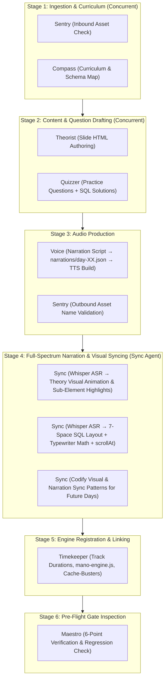

# Maestro — Head Inspector & Pipeline Orchestrator
### Master System Specification (v3.2 — Full-Spectrum Sync & Continuous Evolution)

This skill governs the end-to-end production assembly line, role responsibilities, data contracts, and quality gating across **Day 03 to Day 18**.

---

## 👥 1. Team Roster & Operational Boundaries

| Codename | Role | Input | Deliverable |
|:---|:---|:---|:---|
| **Sentry** | Asset & Directory Verification | Raw workspace audio files | Clean `public/Version-3/DayXX/` asset tree |
| **Compass** | Curriculum & Schema Mapping | SQL Syllabus & Seed DBs | Topic Spec, DB Schema Map, Target Tables |
| **Theorist** | Theory Slide Authoring | Topic Spec & Asset paths | `COURSE_CONTENT['dayXX'].slides` HTML |
| **Quizzer** | Practice & Interview Questions | DB Schema & Difficulty Arc | `COURSE_CONTENT['dayXX'].practiceQuestions` |
| **Voice** | Narration Script & Audio Production | Slide content & Solution SQL | Normalized MP3 files in `public/Version-3/DayXX/` |
| **Sync** *(Upgraded)* | **Full-Spectrum Narration & Visual Syncing + Pattern Evolution** | Theory & Solution MP3s + Slide HTML + Solution SQL | 1) Whisper ASR sub-second Theory Visual Sync handlers (`updateTableHighlights`, card spotlights, timeline progressions)<br>2) `solutionEvents` JSON with 7-space layout<br>3) Codified sync patterns for future day evolution |
| **Timekeeper** | Timeline Stitching & Engine Wiring | Audio durations + Track list | `mano-engine.js` registry, Cache-busters |
| **Maestro** | **Head Inspector & Orchestrator** | Gate metrics & Subagent reports | Green-light deployment sign-off & Skill evolution |

---

## 🔄 2. Production Assembly Line & Concurrency Graph



---

## 📦 3. Strict Artifact Data Contracts

### A. Stage 2 Contract (`Theorist` + `Quizzer` → `public/Version-3/content/day-XX.js`)
```typescript
interface DayContentContract {
  day: number;
  title: string;
  db: "retail" | "analytics" | "ecommerce";
  emoji: string;
  slides: Array<{
    title: string;
    duration: string; // "MM:SS"
    html: string;     // Semantic section IDs (#dayXX...) & SVG audio buttons
  }>;
  practiceQuestions: Array<{
    id: number;
    title: string;
    prompt: string;
    starterCode: string;
    expectedQuery: string;
    solutionExplanation: string;
    questionAudio: string; // "DayXX/New_DayXQuestionYY.mp3"
    solutionAudio: string; // "DayXX/New_DayXQuestionYYsol.mp3"
    solutionEvents?: SolutionEventsContract;
  }>;
}
```

### B. Stage 3 Contract (`Voice` → `narrations/day-XX.json`)
```typescript
interface NarrationScriptContract {
  day: number;
  title: string;
  lecture: Record<string, string>;   // "New_DayXPart1audioNN.mp3" → narration text
  questions: Record<string, string>; // "New_DayXQuestionNN.mp3" & "...sol.mp3" → narration text
}
```

**Voice writing rules (enforced):**
- Lecture scripts: 1–3 sentences per audio file. Spoken at natural pace (~130 WPM). Matches exactly what the slide displays.
- Question scripts: State the task clearly and directly.
- Solution scripts: Read out the query verbatim in spoken form (not code). Say column names as words. Say SQL keywords aloud.
- Never include code formatting in narration text — write as spoken words only.

### C. Stage 4 Contracts (`Sync` → Full-Spectrum Visual & Audio Alignment)

#### 1. Theory Visual Sync Handlers (`Sync` → `mano-engine.js`)
```typescript
interface TheoryVisualSyncContract {
  trackSrc: string;        // "DayXX/New_DayXPart1audioNN.mp3"
  visualContainer: string; // DOM ID (e.g., "#day03OpsTable", "#day03PrecWrap")
  elements: Array<{
    selector: string;      // "tbody tr:nth-child(1)", ".prec-card--not", etc.
    activeClass: string;   // "narration-highlight", "row-active-spotlight", etc.
    start: number;         // Whisper ASR word start timestamp (seconds)
    end: number;           // Whisper ASR word end timestamp (seconds)
  }>;
}
```

#### 2. Solution Typewriter Sync (`Sync` → `solutionEvents`)
```typescript
interface SolutionEventsContract {
  code: string; // Formatted with \n and 7-space column indents under SELECT
  segments: Array<{
    text: string;         // Spoken word or code token
    start: number;        // Start timestamp in seconds
    end: number;          // End timestamp in seconds
    charInterval: number; // Rounded to nearest 10ms
  }>;
  scrollAt: number;       // Timestamp in seconds when runCurrentQuery() executes
}
```

---

## 🚦 4. Gate Definitions

```
GATE-1 (Sentry/inbound + Compass):
  ✓ Zero orphaned files in public/Version-3/DayXX/
  ✓ All MP3 files non-empty (size > 10KB)
  ✓ Target database schema exists in db-seeds/

GATE-2 (Theorist + Quizzer):
  ✓ 100% of expectedQuery statements execute without error on SQLite
  ✓ Row count and columns match solutionExplanation
  ✓ Question count is 6–15, difficulty is monotonically non-decreasing

GATE-3 (Voice + Sentry/outbound):
  ✓ narrations/day-XX.json exists with lecture + questions sections
  ✓ Filenames strictly match: New_Day{D}Part1audio{NN}.mp3, New_Day{D}Question{NN}.mp3, New_Day{D}Question{NN}sol.mp3
  ✓ All MP3 file sizes > 10KB (non-empty, valid TTS output)
  ✓ Zero duplicate question audio references in day-XX.js HTML
  ✓ Every practiceQuestion[].questionAudio and .solutionAudio has a corresponding file on disk
  ✓ Audio play buttons wired in both the theory slide HTML AND practiceQuestions[] objects

GATE-4 (Sync — Full-Spectrum Sync Inspection):
  ✓ Theory Visual Elements: 100% of narrated rows, comparison cards, Venn diagrams, and timeline steps have verified Whisper ASR millisecond timestamps.
  ✓ Zero stale hardcoded animation intervals in mano-engine.js.
  ✓ Multi-column queries formatted with 7-space column alignment directly under SELECT.
  ✓ Typewriter charInterval finishes within ±150ms of audio end.
  ✓ scrollAt timestamp occurs after all code typing segments complete.
  ✓ Newly developed theory sync patterns are codified into the Active Rule Registry for future day reuse.

GATE-5 (Timekeeper):
  ✓ node -c passes with zero syntax errors on mano-engine.js and day-XX.js
  ✓ dayXXTracks registry contains theory + question + solution tracks
  ✓ sum(dayXXDurations) equals sum of actual audio file durations (±1s)
  ✓ Cache-buster ?v=XX.X incremented on touched HTML files

GATE-6 (Maestro Live Checks):
  6.1 Master Timeline: Progress bar duration == total calculated audio duration.
  6.2 Timeline Seeking: Dragging scrubber instantly updates UI question card, editor, and active tab.
  6.3 Theory Sync: Visual rows, cards, and diagrams light up in exact synchrony with the narrator's voice.
  6.4 Typewriter Sync: Code character typing matches narrator speech pacing in real time.
  6.5 Single-Play Isolation: Individual play on Question/Solution pauses cleanly at end without advancing to next slide.
  6.6 SVG Icon State: Standard SVGs only; Navbar, Timeline, and Card buttons toggle cleanly between Play (▶) and Pause (⏸).
  6.7 Grading & Execution: Query submission triggers correct SQLite execution and score banner updates.
```

---

## 🧬 5. Active Rule Registry (Learned Baseline)

```
[SYNC-001] [STATUS: active] [SCOPE: Sync]
Statement: All multi-column SQL queries in solutionEvents.code must be formatted multi-line with 7-space column alignment directly under SELECT.
Added: Day02 — single-line queries exceeded code viewport and caused poor student readability.
Supersedes: none

[SYNC-002] [STATUS: active] [SCOPE: Sync]
Statement: Spoken keywords uttered within <50ms of each other must be grouped into a single segment to prevent requestAnimationFrame sub-second frame stutter.
Added: Day02 — rapid 'SELECT DISTINCT' words caused jittery typewriter pauses.
Supersedes: none

[SYNC-003] [STATUS: active] [SCOPE: Sync]
Statement: Theory Visual Synchronization Protocol: Every animated visual element (table row, card, Venn diagram, lifecycle node) referenced in theory narration MUST have sub-second Whisper ASR timestamps extracted and wired in mano-engine.js timeupdate dispatch.
Added: Day03 — hardcoded legacy timestamps caused table rows to desync completely from narration.
Supersedes: none

[SYNC-004] [STATUS: active] [SCOPE: Sync]
Statement: Theory Sync Evolution & Pattern Porting: Any newly established theory visual sync pattern (e.g., table row multi-segment highlight, multi-card precedence highlight, execution order timeline step progression) must be abstracted and documented as a reusable pattern for all future days.
Added: Day03 — user mandated that Sync agent take complete ownership of theory visual syncing and evolve patterns for subsequent days.
Supersedes: none

[SYNC-005] [STATUS: active] [SCOPE: Sync]
Statement: Zero Stale Hardcoded Timestamps: Whenever narration audio is regenerated or revised via Voice TTS, Sync MUST immediately rerun Whisper ASR to recalibrate visual animation timings against actual audio length.
Added: Day03 — changing audio file duration broke hardcoded row highlight intervals.
Supersedes: none

[VOICE-001] [STATUS: active] [SCOPE: Voice]
Statement: Voice must ALWAYS create narrations/day-XX.json BEFORE running the TTS build. The JSON is the source of truth — if it doesn't exist, build-audio.js will error and produce no files. Never run build-audio.js before the JSON is written and validated.
Added: Day03 — discovered that Day03 had 13 theory MP3s on disk but no narrations/day-03.json, and zero question/solution MP3s because the JSON was never authored.
Supersedes: none

[VOICE-002] [STATUS: active] [SCOPE: Voice]
Statement: When a day already has existing theory MP3s on disk with matching cached hashes, Voice must only add the NEW entries (questions/solutions) to the JSON and run build-audio.js — the cache system will skip already-generated files automatically. Never delete existing MP3s before running the build.
Added: Day03 — 13 theory MP3s existed and were valid; only the 12 question+solution files were missing.
Supersedes: none

[VOICE-003] [STATUS: active] [SCOPE: Voice]
Statement: After TTS build completes, Voice must verify each generated MP3 is >10KB (non-empty, valid audio). Files <10KB indicate a TTS engine failure and must be regenerated with --force flag.
Added: Day03 — edge-tts can silently produce 0-byte or corrupt files if the Python process is interrupted.
Supersedes: none

[THEORIST-001] [STATUS: active] [SCOPE: Theorist]
Statement: Every .slide-section in the theory HTML must contain at least one unique ID target (e.g., #dayXXWhere, #dayXXCompOps) that exactly matches a corresponding target in day03Tracks in mano-engine.js.
Added: Day03 — sections without matching track targets were never spotlighted during narration playback.
Supersedes: none

[THEORIST-002] [STATUS: active] [SCOPE: Theorist]
Statement: No inline CSS inside a .slide-section may set opacity:0 on child elements without a paired .revealed or .narration-highlight class escape hatch. Opacity:0 applied globally during playback causes cards to permanently disappear.
Added: Day03 — #day03PrecWrap.narration-active .prec-card { opacity:0 } broke NOT/AND/OR card visibility during narration.
Supersedes: none

[TIMEKEEPER-001] [STATUS: active] [SCOPE: Timekeeper]
Statement: Play/Pause button innerHTML must use inline standard SVGs (<svg class="play-icon"...> and <svg class="pause-icon"...>), never raw unicode characters or '?' literals.
Added: Day01 — encoding mismatch caused browsers to render '?' square boxes.
Supersedes: none

[TIMEKEEPER-002] [STATUS: active] [SCOPE: Timekeeper]
Statement: onNarrationSegmentEnded must check if (playbackMode === 'single') and cleanly execute activeAudioInstance.pause(), activeAudioInstance = null, updatePlayButtonStates(false), and return immediately without advancing track index.
Added: Day01 — single question playback was falling through and re-playing Question 02 in an infinite loop.
Supersedes: none

[TIMEKEEPER-003] [STATUS: active] [SCOPE: Timekeeper]
Statement: All programmatic CodeMirror setValue operations during typewriter playback must be wrapped in isProgrammaticTyping = true lock guards to prevent accidental user change event firing.
Added: Day01 — editor focus and change events were overriding narration typing.
Supersedes: none

[QUIZZER-001] [STATUS: active] [SCOPE: Quizzer]
Statement: Every practice question must provide an executable expectedQuery and a non-empty starterCode comment block.
Added: Day01 — grading engine threw null reference when grading questions without expectedQuery.
Supersedes: none

[SENTRY-001] [STATUS: active] [SCOPE: Sentry]
Statement: Practice question audio paths must be namespaced with 'DayXX/' directory prefix in single-topic mode (e.g., 'Day03/New_Day3Question01.mp3').
Added: Day02 — root-level audio lookups failed 404 on Vercel deployment.
Supersedes: none
```
