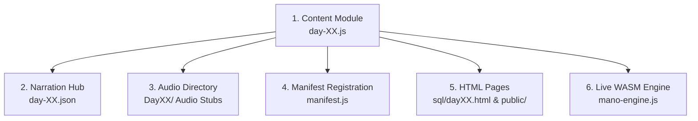
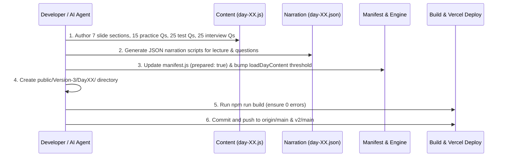

# 📘 Manodemy SQL Track — Day Creation Blueprint & Living Logbook
*(Master Operating Procedure for Days 06–18)*

---

## 🎯 Executive Overview
This document is the **Single Source of Truth (SSOT)** for building, upgrading, and validating SQL track days (Days 06 to 18) in Manodemy. It synthesizes all architecture patterns, lessons learned, and gold standards established during the creation of **Day 04** and **Day 05**.

Every day must deliver a **world-class, interactive, audio-narrated, and auto-graded SQL studio experience** matching FAANG/LeetCode standards.

---

## 🏗️ The 6-Pillar Architecture of a Manodemy SQL Day

Every day consists of 6 interconnected deliverables:



### Deliverable Checklist per Day:
1. **`public/Version-3/content/day-XX.js`**:
   - **Slide HTML**: 7 structured sections with Learning Objective, visual comparison tables, code blocks, warning/pro-tip boxes, and **20–25 `playAudio()` inline triggers**.
   - **Top 25 Interview Q&As**: Embedded inside `.interview-box` with crisp, 2-to-3 sentence answers.
   - **15 Practice Questions**: Formatted in **LeetCode / Market-Standard Format** with `[Difficulty]` tag, real-world business scenario, explicit output column aliases, `questionAudio`, and `solutionAudio`.
   - **25 Test Questions**: Graded test questions with clean reference SQL queries (`q.ref`).
2. **`narrations/day-XX.json`**:
   - `lecture`: TTS narration scripts for every slide heading, table, code block, and callout.
   - `questions`: 15 question intro scripts + 15 solution walkthrough narration scripts (30 total).
3. **`public/Version-3/DayXX/`**: Audio directory stub ready for TTS MP3 generation.
4. **`public/Version-3/content/manifest.js`**: Registered with `prepared: true` and `comingSoon: false`.
5. **`sql/dayXX.html` & `public/sql/dayXX.html`**: Synced with fresh cache-busting version tags (`?v=32.0`).
6. **`public/Version-3/mano-engine.js`**: Ensure `loadDayContent()` coming soon threshold is incremented to unlock the day.

---

## 📐 Detailed Style & Layout Specifications

### 1. Slide Theory Layout (Concise & High-Retention)
- **Learning Objective Box**: 1 punchy sentence focusing on the analyst deliverable.
- **Visual Chunking**: Avoid dense paragraphs. Use 1-line concept statements followed by bulleted mental models.
- **Side-by-Side Comparison Tables**: Provide quick lookup tables for syntax, behavior on NULLs, and real-world use cases.
- **Audit Formulas**: Highlight actionable SQL patterns (e.g. `COUNT(*) - COUNT(col) = Missing Rows`).
- **Inline Audio Buttons**: Every major heading, table, code block, and callout must include:
  ```html
  <button class="audio-play-btn" onclick="playAudio('DayXX/New_DayXXPart1audioNN.mp3', this)" title="Play narration">
    <svg class="play-icon" width="12" height="12" viewBox="0 0 24 24" fill="currentColor"><path d="M8 5v14l11-7z"/></svg>
  </button>
  ```

### 2. Practice Questions (LeetCode Market-Standard Format)
Each practice question must follow this exact HTML prompt structure:
```javascript
{
  "id": 1,
  "prompt": "<strong>[Difficulty] Problem Title</strong><br/>Business Context & Scenario. Write a query from <code>table_name</code> to calculate metric1 (<code>alias_1</code>), metric2 (<code>alias_2</code>)...",
  "referenceSql": "SELECT col1 AS alias_1, col2 AS alias_2 FROM table_name;",
  "questionAudio": "DayXX/New_DayXXQuestion01.mp3",
  "solutionAudio": "DayXX/New_DayXXQuestion01sol.mp3"
}
```

### 3. Text Alignment Rule
- Both practice questions (`.question-prompt`) and test questions (`.test-question-prompt`) **must always render with justified alignment**:
  ```css
  text-align: justify !important;
  text-justify: inter-word !important;
  ```

### 4. Test Portal & Answer Validation Engine
- 25 test questions auto-graded using `window.gradeSubmission(studentSQL, question, db)`.
- Validates:
  1. Column count match.
  2. Row count match.
  3. Cell-level values with floating-point tolerance ($\epsilon = 0.01$) and NULL-safety.

---

## 🛠️ Step-by-Step Day Creation Workflow



---

## 📋 Comprehensive Quality Assurance Matrix

Before considering any day complete, run this verification checklist:

| # | Check Item | Target | Verification Method |
|---|---|:---:|---|
| 1 | Slide sections | **7** | Review HTML in `day-XX.js` |
| 2 | Inline audio triggers (`playAudio`) | **20–25** | Regex count in `day-XX.js` |
| 3 | Practice questions (with audio keys) | **15** | `practiceQuestions.length === 15` |
| 4 | Test questions (with `ref`) | **25** | `testQuestions.length === 25` |
| 5 | Interview Q&As | **25** | Count `<strong>Q\d+:` in slide HTML |
| 6 | Narration Lecture Scripts | **20–25** | Keys in `day-XX.json.lecture` |
| 7 | Narration Question Scripts | **30** | Keys in `day-XX.json.questions` |
| 8 | Justified text alignment | **Active** | Verified in `styles.css` |
| 9 | Next.js compilation | **Success** | `npm run build` exits with code 0 |
| 10 | Git remotes synced | **Live** | Pushed to `origin/main` & `v2/main` |

---

## 📝 Living Decision Logbook & Changelog

### 🔹 Day 01 (SQL Foundations & Interview Q&A Sync) — 2026-08-21
- **Sub-Languages Table Spotlight & Fixed Layout**: Implemented `updateDay01SqlSubLanguagesHighlights(activeTarget, isPlaying)` in `mano-engine.js` covering `audio16` (Intro) through `audio21` (`DQL`, `DML`, `DDL`, `TCL`, `DCL`).
- **Fixed Position & Zero-Jerk Transitions**: The table stays completely steady and stationary on screen during keyword-by-keyword narration. Sub-track transitions inside the same mounted section bypass scroll jumping and pop-in animations, smoothly highlighting each row with the sapphire spotlight border.
- **Single Question Visibility during Narration**: When any interview question plays, only the active question card is displayed inside `.interview-box`, hiding inactive sibling questions for maximum clarity. All questions are restored when paused or stopped.

### 🔹 Day 05 (Aggregate Functions) — 2026-08-21
- **Upgrade**: Fully upgraded slide theory to 7 outcome-focused sections with 23 `playAudio()` hooks.
- **Practice Expansion**: Expanded practice questions from 12 to 15 (added conditional aggregation `SUM(CASE WHEN...)`, weighted average price calculation, and `GROUP_CONCAT`).
- **Formatting Overhaul**: Converted practice questions to LeetCode standard format (`[Difficulty]`, business scenario, explicit aliases).
- **Test Portal Bug Fix**: Diagnosed and fixed fatal error where `renderTestQuestion`, `switchTestQuestion`, and `runTestQuery` were missing in `mano-engine.js`.
- **CSS Enhancement**: Applied `text-align: justify` to all question prompts and test question prompts.
- **Access Control**: Updated `loadDayContent()` threshold to unlock Day 05 for all learners.
- **Narration Engine Rollout**: Generated all 53 MP3 voice files via Microsoft `en-US-AndrewNeural` (`public/Version-3/Day05/`).
- **Track & Sync Wiring**: Registered `day05Tracks`, exact durations array in `day05Durations`, `questionAudioMap['day05']`, and multi-line formatted typewriter sync in `questionSolutionMap['day05']`.
### 🔹 Day 01 Topic 01 (100% Rich SQL Coach & Interactive Schema Peeking Suite) — 2026-08-21
- **100% Rich SQL Coach Guidance System**:
  - Implemented comprehensive context-aware diagnostic engine in `analyzeQueryError()` and `renderError()`.
  - Accurately detects and coaches across incomplete queries:
    - Incomplete `FROM` (e.g. `SELECT * FROM`) ➔ *"You opened a FROM clause but haven't specified which table to query."* with one-click fix `⚡ Add 'employees;'`.
    - Incomplete `SELECT` ➔ *"Specify what columns you want to retrieve. Use `*` or list column names..."* with one-click fix `⚡ Add '* FROM employees;'`.
    - Incomplete `WHERE`, `ORDER BY`, and `GROUP BY` clauses with sample contextual completions.
    - Unclosed single quotes `'` and unmatched parentheses `()`.
    - Keyword typos (`FORM` ➔ `FROM`, `SELEST` ➔ `SELECT`, `WHER` ➔ `WHERE`, `GRUP BY` ➔ `GROUP BY`) with one-click auto-replace button (`replaceTypoInEditor`).
    - Schema fuzzy matching via Levenshtein distance for misspelled columns and tables.
- **Interactive Schema Hover-to-Peek & Tap-to-Insert (Web & Mobile)**:
  - Any table name in `<code>` tags (e.g. `<code>employees</code>`, `<code>sqlite_master</code>`) in theory slides, practice questions, and test questions triggers an interactive glassmorphic popover.
  - Implemented safe debounced hover bridge (`scheduleHideSchemaPeekTooltip` / `cancelHideSchemaPeekTooltip`) so moving the mouse from the trigger code tag to the popover card never dismisses it prematurely.
  - Mobile & desktop click/tap locks the popover open until dismissed.
  - Clicking any column chip or table name inside the popover instantly pastes it into the active CodeMirror editor at the current cursor position with emerald green visual feedback.
  - Column `<code>` tags in problem prompts are also directly clickable to insert into the editor.
  - Eliminated all `??` character artifacts by replacing emojis with pure inline SVGs.
- **Mobile SQL Quick-Syntax Toolbar**: Added horizontal scrollable syntax chips above the code editor on mobile viewports for effortless symbol and keyword insertion.

### 🔹 Practice Question Narration & Typing Syncing Inspector — 2026-08-21
- **Tooling Architecture**: Built `scripts/inspect_solution_sync.py` powered by `openai-whisper` for automated word-level speech-to-code alignment.
- **Precision Synchronization**:
  - Automatically breaks multi-line SQL solutions into clauses and column expressions.
  - Matches spoken keywords (e.g. `SELECT`, `column_name`, `AS alias`, `FROM`, `WHERE`, `GROUP BY`, `ORDER BY`) to speech timestamps.
  - Dynamically calculates `charInterval` (ms per character) so typing completes right as speech ends.
  - Detects execution keywords (*"run"*, *"execute"*, *"output"*) to set exact `scrollAt` timestamps.
- **Skill Registration**: Added to `.agents/skills/practice-question-audio-sync/scripts/inspect_solution_sync.py` and updated `SKILL.md`.

---

## 🚀 Standard Template for Next Day (Day 06 — GROUP BY & HAVING)

When initiating **Day 06**, use the following structure:
- **Topic**: `GROUP BY & HAVING: Building Reports by Segment`
- **Slide Sections**:
  1. Why Segmenting Data Matters (Row aggregation vs Group aggregation)
  2. Single-Column `GROUP BY` (Departmental & Regional breakdowns)
  3. Multi-Column `GROUP BY` (Hierarchical multi-level grouping)
  4. The `WHERE` vs `HAVING` Golden Rule (Filtering before vs after aggregation)
  5. Expressions in `GROUP BY` & Aliasing Rules
  6. Common Grouping Pitfalls (Mixing non-aggregated columns without `GROUP BY`)
  7. Advanced Reporting Patterns (Conditional counts with `GROUP BY`)
- **15 Practice Questions**: Segmented sales, order counts per customer, multi-department salary audits, `HAVING` filters on volume/spending.
- **25 Interview Questions**: Deep dives on execution order (FROM $\to$ WHERE $\to$ GROUP BY $\to$ HAVING $\to$ SELECT $\to$ ORDER BY), performance indexing on grouped keys, hash aggregate vs stream aggregate engines.
